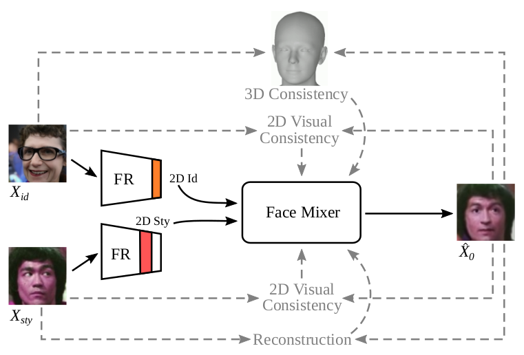

# TCDiff

> **TCDiff: Triple Condition Diffusion Model with 3D Constraints for Stylizing Synthetic Faces**  
> Bernardo Biesseck, Pedro Vidal, Luiz Coelho, Roger Granada, David Menotti  
> In SIBGRAPI 2024  

[Paper](assets/TCDiff_2024.pdf)

We propose a Triple Condition Diffusion Model (TCDiff) to improve face style transfer from real to synthetic faces through 2D and 3D facial constraints, enhancing face identity consistency while keeping the necessary high intra-class variance for training face recognition models with synthetic data.

  
### UNDER CONSTRUCTION
